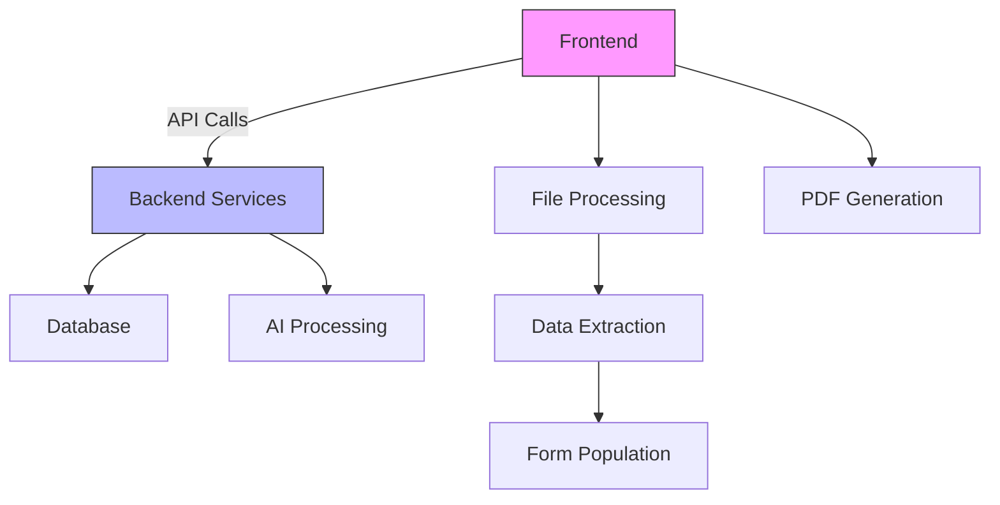
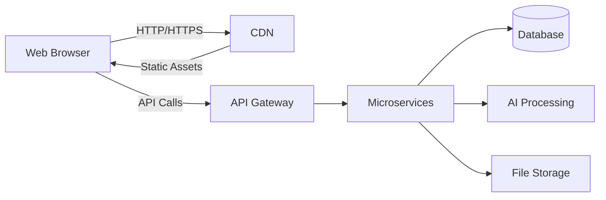
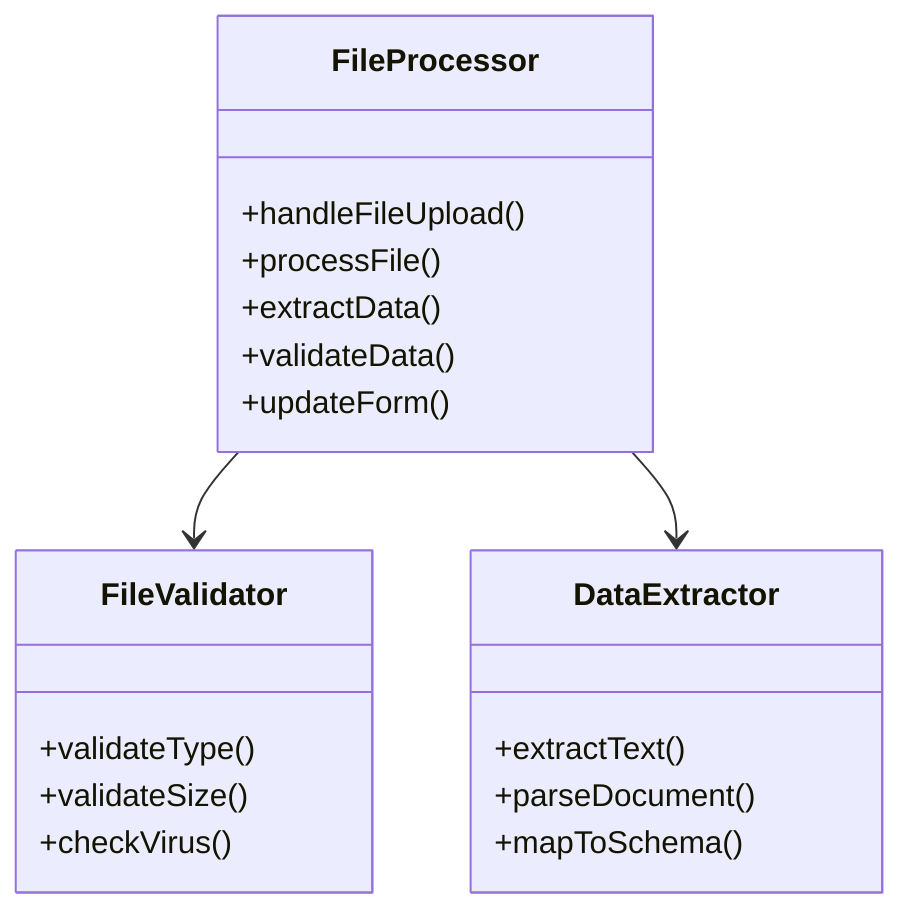
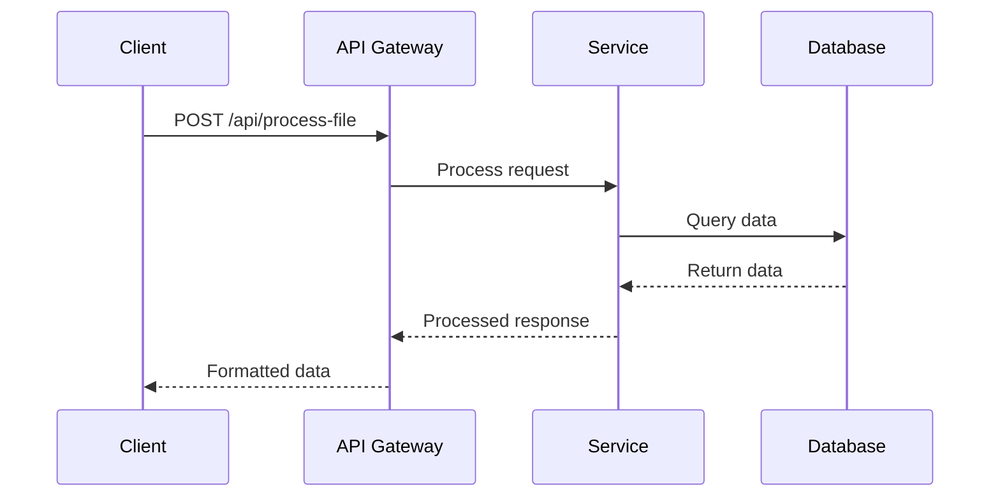
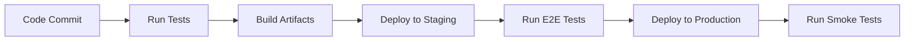

# 🛠️ Nosta Quote AI - Technical Documentation



## 📋 Table of Contents
1. [System Architecture](#system-architecture)
2. [Tech Stack](#-tech-stack)
3. [Component Architecture](#-component-architecture)
4. [Data Flow](#-data-flow)
5. [API Integration](#-api-integration)
6. [State Management](#-state-management)
7. [File Processing](#-file-processing)
8. [Security](#-security)
9. [Performance](#-performance)
10. [Testing](#-testing)
11. [Deployment](#-deployment)
12. [Troubleshooting](#-troubleshooting)
13. [Future Roadmap](#-future-roadmap)

## 🏗️ System Architecture

### High-Level Overview


### Key Components
1. **Frontend Application**
   - React-based single-page application
   - Responsive design for all devices
   - Client-side state management

2. **Backend Services**
   - RESTful API endpoints
   - Authentication & Authorization
   - Business logic and validation

3. **Data Layer**
   - PostgreSQL for structured data
   - Redis for caching
   - Object storage for file uploads

## 🛠️ Tech Stack

### Core Technologies
| Category | Technology | Purpose |
|----------|------------|---------|
| Frontend | React 18+ | UI Components |
| | TypeScript | Type Safety |
| | Vite | Build Tool |
| | Tailwind CSS | Styling |
| Backend | Node.js | Runtime |
| | Express | API Server |
| | N8N | Workflow Automation |
| Database | PostgreSQL | Primary Database |
| | Redis | Caching & Sessions |
| DevOps | Docker | Containerization |
| | GitHub Actions | CI/CD |
| | AWS/GCP | Cloud Hosting |

## 🧩 Component Architecture

### FileProcessor Component


## 🔄 Data Flow

### File Upload Process
1. User selects a file
2. Client-side validation (size, type)
3. File is uploaded to temporary storage
4. Backend processes the file
5. Extracted data is returned to the client
6. Form is populated with extracted data

### API Request Flow


## 🔌 API Integration

### Authentication
```typescript
// Example JWT Authentication
const authHeader = {
  'Authorization': `Bearer ${token}`,
  'Content-Type': 'application/json'
};
```

### Rate Limiting
- 100 requests per minute per IP
- 1000 requests per day per user
- Exponential backoff for failed requests

## 🗃️ State Management

### State Structure
```typescript
interface AppState {
  user: User | null;
  cart: CartItem[];
  currentProduct: Product | null;
  formData: FormData;
  ui: {
    isLoading: boolean;
    error: string | null;
    activeTab: 'file' | 'form';
  };
}
```

## 📂 File Processing

### Supported Formats
| Format | Extraction Method | Notes |
|--------|-------------------|-------|
| PDF | PDF.js | Text and form data |
| DOCX | mammoth.js | Preserves formatting |
| XLSX | SheetJS | Supports formulas |
| Images | Tesseract.js | OCR processing |

### Processing Pipeline
1. File validation
2. Content extraction
3. Data normalization
4. Entity recognition
5. Form mapping

## 🔒 Security

### Current Implementation
- **Data Transmission**: Uses HTTPS (handled by Supabase)
- **Data Storage**:
  - Quotes stored in `localStorage` (persists until cleared)
  - No server-side storage of processed files
- **File Processing**:
  - Client-side processing only
  - No file content leaves the browser
  - No virus scanning implemented

### Security Considerations
- **Client-Side Storage**:
  - `localStorage` used for quote persistence
  - No automatic data expiration
  - Accessible to any script on the page
- **File Handling**:
  - No server-side validation
  - No size limits on file uploads
  - No content scanning
- **Authentication**:
  - No user authentication required
  - No rate limiting on API calls

### Recommended Improvements
1. Implement server-side processing with proper validation
2. Add file size and type restrictions
3. Implement user authentication
4. Add CSRF protection
5. Set up proper data retention policies

## ⚡ Performance

### Optimization Techniques
- Code splitting
- Lazy loading
- Image optimization
- Caching strategies
- Database indexing

## 🧪 Testing

### Test Coverage
| Type | Tools | Coverage Target |
|------|-------|-----------------|
| Unit | Jest | 80%+ |
| Integration | React Testing Library | 70%+ |
| E2E | Cypress | Critical paths |
| Performance | Lighthouse | 90+ score |

## 🚀 Deployment

### CI/CD Pipeline


## 🐛 Troubleshooting

### Common Issues
| Symptom | Possible Cause | Solution |
|---------|----------------|----------|
| File upload fails | Size/format issue | Check console logs |
| Slow performance | Large file processing | Optimize processing |
| API timeouts | Network issues | Check connection |
| Data mismatch | Schema changes | Validate data mapping |

## 🛣️ Future Roadmap

### Short-term (Q4 2024)
- [ ] Implement offline support
- [ ] Add more file type support
- [ ] Enhance error handling

### Medium-term (Q1 2025)
- [ ] Mobile app development
- [ ] Advanced analytics
- [ ] API versioning

### Long-term (2025+)
- [ ] AI-powered recommendations
- [ ] Multi-language support
- [ ] Integration with ERP systems

---
*Last Updated: October 2024*
*Version: 2.1.0*

## 📋 Table of Contents
1. [Architecture Overview](#architecture-overview)
2. [Tech Stack](#tech-stack)
3. [Component Architecture](#component-architecture)
4. [Data Flow](#data-flow)
5. [API Integration](#api-integration)
6. [State Management](#state-management)
7. [File Processing](#file-processing)
8. [Deployment](#deployment)
9. [Testing](#testing)
10. [Troubleshooting](#troubleshooting)

## Architecture Overview
Nosta Quote AI follows a modern React-based frontend architecture with a clear separation of concerns between UI components, state management, and API interactions.

## Tech Stack
- **Frontend Framework**: React 18+ with TypeScript
- **Build Tool**: Vite
- **Styling**: Tailwind CSS with Shadcn/ui components
- **State Management**: React Context + Local State
- **Form Handling**: React Hook Form
- **Data Fetching**: Fetch API with custom hooks
- **PDF Generation**: jsPDF
- **Icons**: Lucide React

## Component Architecture

### Core Components
1. **PriceCalculatorSupabase.tsx**
   - Main container for the quote generation flow
   - Manages form state and submission
   - Handles communication with backend services

2. **FileProcessorNew.tsx**
   - Handles file uploads and processing
   - Extracts product information from various file formats
   - Provides a drag-and-drop interface

3. **ChatInterface.tsx**
   - Real-time chat interface with AI assistant
   - Manages message history and session state
   - Integrates with N8N webhook for AI responses

## Data Flow
1. **User Input** → **Component State** → **API** → **UI Update**
2. File uploads are processed client-side before being sent to the server
3. Chat messages are queued and processed asynchronously

## API Integration
### Endpoints
- **N8N Webhook**: `https://nosta.app.n8n.cloud/webhook/f8957a80-b4c3-4bb4-b3c0-256624cbcc40`
- **Supabase**: Used for data persistence and authentication

### Request/Response Format
```typescript
// Example API Request
{
  "sessionId": "unique-session-id",
  "message": "user message",
  "context": {
    "currentProduct": "product-id",
    "previousMessages": [...]
  }
}
```

## State Management
- **Local State**: Used for UI state and form data
- **Context API**: For global state like user session and cart
- **URL State**: For sharing and deep linking

## File Processing
### Supported Formats
- Images (JPG, PNG, etc.)
- PDF Documents
- Word Documents (.doc, .docx)
- Excel Files (.xls, .xlsx)

### Processing Flow
1. File validation (size, type)
2. Client-side processing (if possible)
3. Server-side extraction (if needed)
4. Data mapping to product model
5. Form population

## Deployment
### Prerequisites
- Node.js 16+
- pnpm or npm
- Supabase project

### Build Commands
```bash
# Install dependencies
pnpm install

# Start development server
pnpm dev

# Build for production
pnpm build

# Preview production build
pnpm preview
```

## Testing
### Unit Tests
Run tests using:
```bash
pnpm test
```

### Testing Strategy
- Component testing with React Testing Library
- Integration tests for API calls
- E2E tests for critical user flows

## Troubleshooting
### Common Issues
1. **File Upload Fails**
   - Check file size and format
   - Verify CORS settings on the server
   - Check browser console for errors

2. **Chat Not Responding**
   - Verify network connection
   - Check if N8N service is running
   - Look for errors in browser console

3. **Form Validation Issues**
   - Check required fields
   - Verify input formats
   - Check for validation messages

## Performance Considerations
- Implement code splitting for larger components
- Use React.memo for expensive renders
- Optimize image and asset loading
- Implement proper error boundaries

## Security
- Input sanitization on all user inputs
- Secure API key handling
- XSS protection
- CSRF protection for forms

## Future Improvements
- Implement offline support
- Add more file type support
- Enhance error handling and recovery
- Improve accessibility
- Add more comprehensive tests
