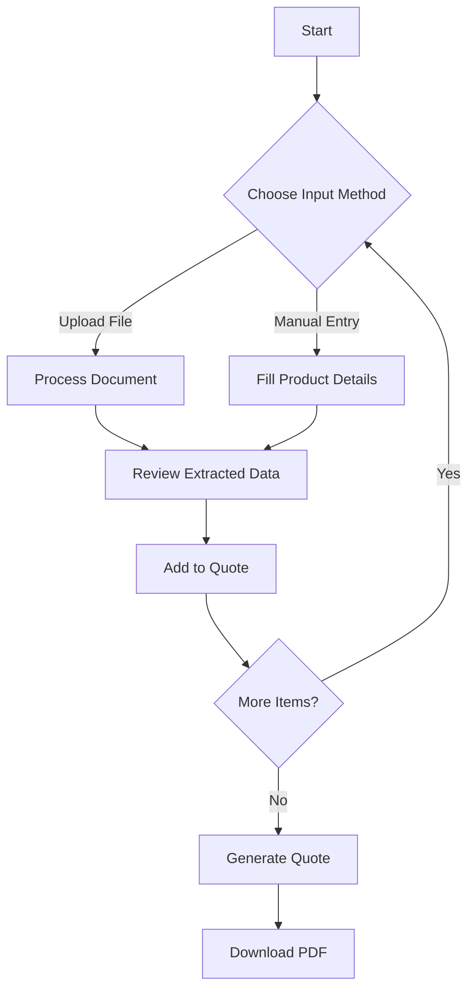

# 📚 Nosta Quote AI - Complete User Guide

## 🎯 Introduction
Nosta Quote AI is your intelligent assistant for generating accurate product quotations quickly and efficiently. Whether you're a procurement specialist, engineer, or business owner, this guide will help you leverage all the features of our system.

## 🚀 Getting Started
### System Requirements
- Modern web browser (Chrome, Firefox, Safari, or Edge)
- Internet connection
- For file uploads: Documents under 10MB in supported formats

### First-Time Setup
1. **Access the Application**
   - Open your preferred web browser
   - Navigate to the Nosta Quote AI URL
   - No installation or account creation required

2. **Understanding the Interface**
   - **Top Navigation**: Switch between File Upload and Manual Entry
   - **Main Workspace**: Where you'll interact with the system
   - **Chat Panel**: Get assistance from the AI assistant
   - **Quote Summary**: Review your current quotation

## 📁 Using the File Upload
### Supported File Types
- **Documents**: PDF, DOC, DOCX
- **Spreadsheets**: XLS, XLSX
- **Images**: JPG, PNG (with embedded text)
- **Maximum Size**: 10MB per file

### Step-by-Step: Uploading a File
1. **Select the File**
   - Click the upload area or drag and drop your file
   - The system will show a preview of the selected file

2. **Processing**
   - The AI extracts relevant information automatically
   - Processing time varies by file size (typically 5-30 seconds)

3. **Review Extracted Data**
   - Check the extracted product details
   - Edit any incorrect information
   - Add missing details if needed

### Common File Upload Scenarios
| Scenario | What to Do |
|----------|------------|
| File too large | Compress the file or reduce its size |
| Unsupported format | Convert to PDF or contact support |
| Poor quality scan | Ensure good lighting and retake the photo |
| Multiple pages | The system processes all pages automatically |

## ✍️ Manual Entry
### Product Information
Fill in these details for each product:

1. **Basic Information**
   - Product name/description
   - Quantity needed
   - Required delivery date

2. **Technical Specifications**
   - Material type
   - Dimensions (length, width, height)
   - Weight
   - Any special requirements

### Using the Form
- Required fields are marked with a red asterisk (*)
- Use the tab key to move between fields
- The system provides suggestions as you type
- Save frequently to avoid losing data

## 💬 Chat Interface
### Getting Help
Type questions like:
- "What materials are available for this product?"
- "How do I request a bulk discount?"
- "What's the lead time for custom orders?"

### Tips for Better Responses
- Be specific with your questions
- Include relevant product codes when available
- Ask for clarification if needed
- Use the chat history for reference

## 📄 Generating Quotes
### Reviewing Your Quote
1. Check all items in your cart
2. Verify quantities and specifications
3. Review pricing and any applicable discounts

### Export Options
- **PDF**: Professional-looking quote document
- **Email**: Send directly to your inbox
- **Link**: Share a secure link with colleagues

### After Generating a Quote
- Download and save the PDF
- Share with your team if needed
- Use the reference number for future inquiries

## 🔍 Troubleshooting
### Common Issues and Solutions
| Issue | Possible Solution |
|-------|------------------|
| File not uploading | Check file size and format |
| Incorrect data extraction | Use the manual edit feature |
| Slow performance | Check your internet connection |
| Chat not responding | Refresh the page or try again later |

### Getting Support
1. Check the FAQ section
2. Use the chat for immediate assistance
3. Email support@nosta-ai.com
4. Call our helpline: +1-800-NOSTA-AI

## 📱 Mobile Usage
### Optimizing for Mobile
- Use landscape mode for better form filling
- Enable auto-rotate on your device
- Save your progress frequently
- Use the mobile camera for document scanning

## 🔄 Saving and Returning
- Your work is auto-saved as you go
- Use the same device and browser to resume
- No account required - works with browser storage

## 📅 Best Practices
### For Accurate Quotes
- Provide complete specifications
- Include all relevant documentation
- Double-check quantities and measurements
- Consider future needs for bulk discounts

### Data Security
- Your data is transmitted securely using HTTPS
- Files are processed in your browser
- Quotes are saved in your browser's local storage until cleared
- For sensitive information, please avoid including personal or confidential data

---
*Last Updated: October 2024*
*Version: 2.1.0*

## 📖 Table of Contents
1. [Introduction](#introduction)
2. [Getting Started](#getting-started)
3. [Using the File Upload](#using-the-file-upload)
4. [Manual Entry](#manual-entry)
5. [Chat Interface](#chat-interface)
6. [Generating Quotes](#generating-quotes)

## Introduction
Welcome to Nosta Quote AI, your intelligent solution for quick and accurate product quotations. This guide will help you navigate through the application's features.

## Getting Started
1. **Access the Application**: Open the Nosta Quote AI in your web browser
2. **Choose Input Method**:
   - **File Upload**: For processing existing documents
   - **Manual Entry**: For creating quotes from scratch

## Using the File Upload
1. Click on the "Upload File" section
2. Either drag and drop your file or click to browse
3. Supported formats: Images, PDF, Word, Excel (Max 10MB)
4. The system will automatically extract product information
5. Review and edit the extracted data if needed

## Manual Entry
1. Select "Manual Entry"
2. Fill in the product details:
   - Product specifications
   - Dimensions
   - Material
   - Quantity
   - Additional requirements
3. Click "Add to Quote" to add to your current quotation

## Chat Interface
1. Use the chat panel to ask questions about products
2. The AI assistant can help with:
   - Product recommendations
   - Technical specifications
   - Pricing information
   - Order status

## Generating Quotes
1. Review all items in your quote
2. Click "Generate PDF" to create a downloadable quote
3. The system will generate a professional PDF with:
   - Itemized list of products
   - Pricing breakdown
   - Total cost
   - Customer details

## Troubleshooting
- **File not uploading?** Check file size and format
- **Can't find a product?** Try using different keywords in the chat
- **Need help?** Use the chat interface to get support

---
*For additional support, please contact our customer service team.*
